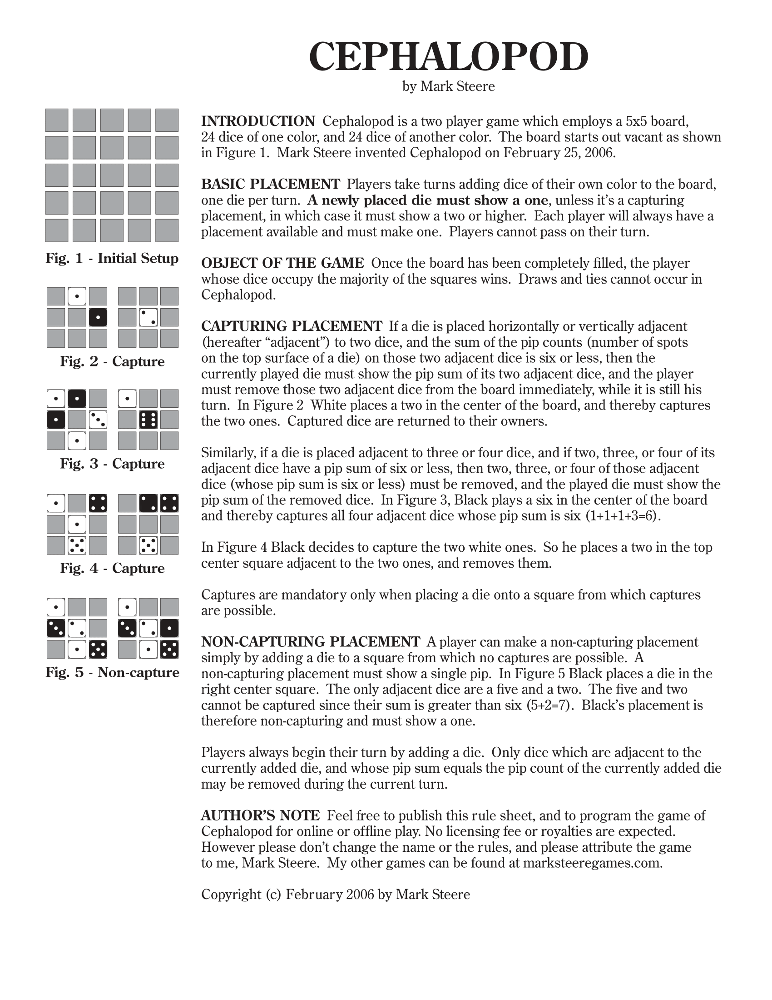

# cephalopod-solver



## descriptiopn
This project aim to solve all the solutions that are possbile on the Mark Steere Cephalopod game based on a starting board and a depth variable (number of laps)

## instalation

### download it
```bash
git clone https://github.com/YoungMame/cephalopod-solver.git
```

### enter the directory
```bash
cd cephalopod-solver
```

### compile the project
```bash
make
```

## using

### exec
```bash
./cephalopod
```

### write in terminal

The first arg is the depth

```bash
./cephalopod
    20 // for example
```

The following lines are a 3 x 3 board

```bash
./cephalopod
    20 // for example
    0 0 0
    0 0 0
    0 0 0
```

